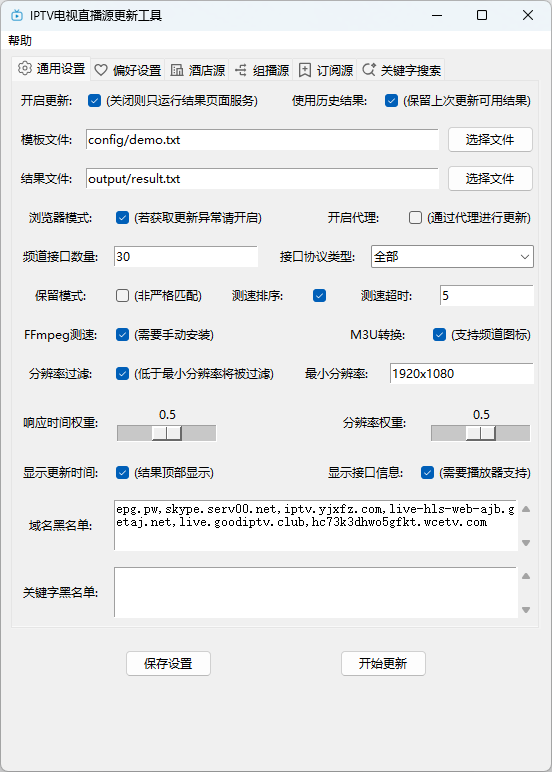

<div align="center">
  
  <h1 align="center">IPTV-API</h1>
</div>

<div align="center">A highly customizable IPTV interface update project 📺, with customizable channel menus, automatic live stream acquisition, speed testing, and validation to generate usable results, achieving 『✨instant playback experience🚀』</div>
<br>
<p align="center">
  <a href="https://github.com/Guovin/iptv-api/releases/latest">
    
  </a>
  <a href="https://www.python.org/">
    
  </a>
  <a href="https://github.com/Guovin/iptv-api/releases/latest">
    
  </a>
  <a href="https://hub.docker.com/repository/docker/guovern/iptv-api">
    
  </a>
  <a href="https://github.com/Guovin/iptv-api/fork">
    
  </a>
</p>

[中文](./README.md) | English

🎉💻[IPTV-Web](https://github.com/Guovin/iptv-web): IPTV live stream management platform, supports online playback and
other features, under development...

- [✅ Features](#features)
- [🔗 Latest results](#latest-results)
- [⚙️ Config parameter](#Config)
- [🚀 Quick Start](#quick-start)
    - [Workflow](#workflow)
    - [Command Line](#command-line)
    - [GUI Software](#gui-software)
    - [Docker](#docker)
- [📖 Detailed Tutorial](./docs/tutorial_en.md)
- [🗓️ Changelog](./CHANGELOG.md)
- [❤️ Appreciate](#appreciate)
- [👀 Follow(Update Subscription + Q&A)](#follow)
- [📣 Disclaimer](#disclaimer)
- [⚖️ License](#license)

📍Subscription sources are from:

- [Guovin/iptv-database](https://github.com/Guovin/iptv-database)
- [iptv-org/iptv](https://github.com/iptv-org/iptv)
- [suxuang/myIPTV](https://github.com/suxuang/myIPTV)
- [kimwang1978/collect-tv-txt](https://github.com/kimwang1978/collect-tv-txt)
- [xzw832/cmys](https://github.com/xzw832/cmys)
- [asdjkl6/tv](https://github.com/asdjkl6/tv)
- [yuanzl77/IPTV](https://github.com/yuanzl77/IPTV)
- [fanmingming/live](https://github.com/fanmingming/live)
- [vbskycn/iptv](https://github.com/vbskycn/iptv)
- [YueChan/Live](https://github.com/YueChan/Live)
- [YanG-1989/m3u](https://github.com/YanG-1989/m3u)

📍Channel icons are from:

- [fanmingming/live](https://github.com/fanmingming/live)

## Features

- ✅ Customize the template to generate the channel you want
- ✅ Supports RTMP streaming (live/hls) to enhance playback experience
- ✅ Supports multiple source acquisition methods: local source, multicast source, hotel source, subscription source,
  keyword search
- ✅ Interface speed verification, obtain delay, speed, resolution, filter invalid interface
- ✅ Preferences: IPv4、IPv6, priority and quantity of interface source sorting, and interface whitelist
- ✅ Scheduled execution at 6:00 AM and 18:00 PM Beijing time daily
- ✅ Supports various execution methods: workflows, command line, GUI software, Docker(amd64/arm64/arm v7)
- ✨ For more features, see [Config parameter](#Config)

## Latest results

- Interface source:

```bash
https://raw.githubusercontent.com/Guovin/iptv-api/gd/output/result.m3u
```

```bash
https://raw.githubusercontent.com/Guovin/iptv-api/gd/output/result.txt
```

or

```bash
https://cdn.jsdelivr.net/gh/Guovin/iptv-api@gd/output/result.m3u
```

```bash
https://cdn.jsdelivr.net/gh/Guovin/iptv-api@gd/output/result.txt
```

- Data source:

```bash
https://raw.githubusercontent.com/Guovin/iptv-api/gd/source.json
```

or

```bash
https://cdn.jsdelivr.net/gh/Guovin/iptv-api@gd/source.json
```

## Config

| Configuration Item     | Description                                                                                                                                                                                                                                                                                                                                                                                                                      | Default Value     |
|:-----------------------|:---------------------------------------------------------------------------------------------------------------------------------------------------------------------------------------------------------------------------------------------------------------------------------------------------------------------------------------------------------------------------------------------------------------------------------|:------------------|
| open_driver            | Enable browser execution, If there are no updates, this mode can be enabled, which consumes more performance                                                                                                                                                                                                                                                                                                                     | False             |
| open_empty_category    | Enable the No Results Channel Category, which will automatically categorize channels without results to the bottom                                                                                                                                                                                                                                                                                                               | False             |
| open_filter_resolution | Enable resolution filtering, interfaces below the minimum resolution (min_resolution) will be filtered, GUI users need to manually install FFmpeg, the program will automatically call FFmpeg to obtain the interface resolution, it is recommended to enable, although it will increase the time-consuming of the speed measurement stage, but it can more effectively distinguish whether the interface can be played          | True              |
| open_filter_speed      | Enable speed filtering, interfaces with speed lower than the minimum speed (min_speed) will be filtered                                                                                                                                                                                                                                                                                                                          | True              |
| open_hotel             | Enable the hotel source function, after closing it all hotel source working modes will be disabled                                                                                                                                                                                                                                                                                                                               | False             |
| open_hotel_foodie      | Enable Foodie hotel source work mode                                                                                                                                                                                                                                                                                                                                                                                             | True              |
| open_hotel_fofa        | Enable FOFA、ZoomEye hotel source work mode                                                                                                                                                                                                                                                                                                                                                                                       | False             |
| open_keep_all          | Enable retain all search results, retain results with non-template channel names, recommended to be turned on when manually maintaining                                                                                                                                                                                                                                                                                          | False             |
| open_local             | Enable local source function, will use the data in the template file and the local source file                                                                                                                                                                                                                                                                                                                                   | True              |
| open_m3u_result        | Enable the conversion to generate m3u file type result links, supporting the display of channel icons                                                                                                                                                                                                                                                                                                                            | True              |
| open_multicast         | Enable the multicast source function, after disabling it all multicast sources will stop working                                                                                                                                                                                                                                                                                                                                 | False             |
| open_multicast_foodie  | Enable Foodie multicast source work mode                                                                                                                                                                                                                                                                                                                                                                                         | True              |
| open_multicast_fofa    | Enable FOFA multicast source work mode                                                                                                                                                                                                                                                                                                                                                                                           | False             |
| open_online_search     | Enable keyword search source feature                                                                                                                                                                                                                                                                                                                                                                                             | False             |
| open_proxy             | Enable proxy, automatically obtains free available proxies, If there are no updates, this mode can be enabled                                                                                                                                                                                                                                                                                                                    | False             |
| open_request           | Enable query request, the data is obtained from the network (only for hotel sources and multicast sources)                                                                                                                                                                                                                                                                                                                       | False             |
| open_rtmp              | Enable RTMP push function, need to install FFmpeg, use local bandwidth to improve the interface playback experience, it is recommended to enable when multiple people use it, it is not recommended to enable for personal use, the workflow does not support this function                                                                                                                                                      | False             |
| open_service           | Enable page service, used to control whether to start the result page service; if deployed on platforms like Qinglong with dedicated scheduled tasks, the function can be turned off after updates are completed and the task is stopped                                                                                                                                                                                         | True              |
| open_sort              | Enable the sorting function (response speed, date, resolution)                                                                                                                                                                                                                                                                                                                                                                   | True              |
| open_subscribe         | Enable subscription source feature                                                                                                                                                                                                                                                                                                                                                                                               | True              |
| open_supply            | Enable compensation mechanism mode, used to control when the number of channel interfaces is insufficient, automatically add interfaces that do not meet the conditions (such as lower than the minimum rate) but may be available to the result, thereby avoiding the result being empty                                                                                                                                        | True              |
| open_update            | Enable updates, if disabled then only the result page service is run                                                                                                                                                                                                                                                                                                                                                             | True              |
| open_update_time       | Enable show update time                                                                                                                                                                                                                                                                                                                                                                                                          | True              |
| open_url_info          | Enable to display interface description information, used to control whether to display interface source, resolution, protocol type and other information, the content after the $ symbol, the playback software uses this information to describe the interface, if some players (such as PotPlayer) do not support parsing and cannot play, you can turn it off                                                                | False             |
| open_use_cache         | Enable the use of local cache data, applicable to the query request failure scenario (only for hotel sources and multicast sources)                                                                                                                                                                                                                                                                                              | True              |
| open_history           | Enable the use of historical update results (including the interface for template and result files) and merge them into the current update                                                                                                                                                                                                                                                                                       | True              |
| app_port               | Page service port, used to control the port number of the page service                                                                                                                                                                                                                                                                                                                                                           | 8000              |
| cdn_url                | CDN proxy acceleration address, used for accelerated access to subscription sources, channel icons and other resources                                                                                                                                                                                                                                                                                                           |                   |
| final_file             | Generated result file path                                                                                                                                                                                                                                                                                                                                                                                                       | output/result.txt |
| hotel_num              | The number of preferred hotel source interfaces in the results                                                                                                                                                                                                                                                                                                                                                                   | 10                |
| hotel_page_num         | Number of pages to retrieve for hotel regions                                                                                                                                                                                                                                                                                                                                                                                    | 1                 |
| hotel_region_list      | List of hotel source regions, 'all' indicates all regions                                                                                                                                                                                                                                                                                                                                                                        | all               |
| ipv4_num               | The preferred number of IPv4 interfaces in the result                                                                                                                                                                                                                                                                                                                                                                            | 5                 |
| ipv6_num               | The preferred number of IPv6 interfaces in the result                                                                                                                                                                                                                                                                                                                                                                            | 5                 |
| ipv6_support           | It is forced to consider that the current network supports IPv6 and skip the check                                                                                                                                                                                                                                                                                                                                               | False             |
| ipv_type               | The protocol type of interface in the generated result, optional values: ipv4, ipv6, all                                                                                                                                                                                                                                                                                                                                         | all               |
| ipv_type_prefer        | Interface protocol type preference, prioritize interfaces of this type in the results, optional values: ipv4, ipv6, auto                                                                                                                                                                                                                                                                                                         | ipv6,ipv4         |
| local_file             | Local source file path                                                                                                                                                                                                                                                                                                                                                                                                           | config/local.txt  |
| local_num              | Preferred number of local source interfaces in the result                                                                                                                                                                                                                                                                                                                                                                        | 10                |
| min_resolution         | Minimum interface resolution, requires enabling open_filter_resolution to take effect                                                                                                                                                                                                                                                                                                                                            | 1920x1080         |
| min_speed              | Minimum interface speed (M/s), requires enabling open_filter_speed to take effect                                                                                                                                                                                                                                                                                                                                                | 0.2               |
| multicast_num          | The number of preferred multicast source interfaces in the results                                                                                                                                                                                                                                                                                                                                                               | 10                |
| multicast_page_num     | Number of pages to retrieve for multicast regions                                                                                                                                                                                                                                                                                                                                                                                | 1                 |
| multicast_region_list  | Multicast source region list, 'all' indicates all regions                                                                                                                                                                                                                                                                                                                                                                        | all               |
| online_search_num      | The number of preferred keyword search interfaces in the results                                                                                                                                                                                                                                                                                                                                                                 | 0                 |
| online_search_page_num | Page retrieval quantity for keyword search channels                                                                                                                                                                                                                                                                                                                                                                              | 1                 |
| origin_type_prefer     | Preferred interface source of the result, the result is sorted according to this order, separated by commas, for example: local, hotel, multicast, subscribe, online_search; local: local source, hotel: hotel source, multicast: multicast source, subscribe: subscription source, online_search: keyword search; If not filled in, it means that the source is not specified, and it is sorted according to the interface rate |                   |
| recent_days            | Retrieve interfaces updated within a recent time range (in days), reducing appropriately can avoid matching issues                                                                                                                                                                                                                                                                                                               | 30                |
| request_timeout        | Query request timeout duration, in seconds (s), used to control the timeout and retry duration for querying interface text links. Adjusting this value can optimize update time.                                                                                                                                                                                                                                                 | 10                |
| sort_timeout           | The timeout duration for speed testing of a single interface, in seconds (s). A larger value means a longer testing period, which can increase the number of interfaces obtained but may decrease their quality. A smaller value means a shorter testing time, which can obtain low-latency interfaces with better quality. Adjusting this value can optimize the update time.                                                   | 10                |
| sort_duplicate_limit   | Number of allowed repetitions for the same domain interface, used to control the number of repetitions when performing speed tests and obtaining resolutions. The larger the value, the more accurate the results, but the time consumption will increase                                                                                                                                                                        | 3                 |
| source_file            | Template file path                                                                                                                                                                                                                                                                                                                                                                                                               | config/demo.txt   |
| subscribe_num          | The number of preferred subscribe source interfaces in the results                                                                                                                                                                                                                                                                                                                                                               | 10                |
| time_zone              | Time zone, can be used to control the time zone displayed by the update time, optional values: Asia/Shanghai or other time zone codes                                                                                                                                                                                                                                                                                            | Asia/Shanghai     |
| urls_limit             | Number of interfaces per channel                                                                                                                                                                                                                                                                                                                                                                                                 | 10                |
| update_time_position   | Update time display position, need to enable open_update_time to take effect, optional values: top, bottom, top: display at the top of the result, bottom: display at the bottom of the result                                                                                                                                                                                                                                   | top               |

## Quick Start

### Workflow

Fork this project and initiate workflow updates, detailed steps are available
at [Detailed Tutorial](./docs/tutorial_en.md)

### Command Line

```shell
pip install pipenv
```

```shell
pipenv install --dev
```

Start update:

```shell
pipenv run dev
```

Start service:

```shell
pipenv run service
```

### GUI Software

1. Download [IPTV-API update software](https://github.com/Guovin/iptv-api/releases), open the software, click update to
   complete the update

2. Or run the following command in the project directory to open the GUI software:

```shell
pipenv run ui
```



### Docker

#### 1. Pull the image

```bash
docker pull guovern/iptv-api:latest
```

🚀 Proxy acceleration (recommended for users in China):

```bash
docker pull docker.1ms.run/guovern/iptv-api:latest
```

#### 2. Run the container

```bash
docker run -d -p 8000:8000 guovern/iptv-api
```

##### Mount(Recommended):

This allows synchronization of files between the host machine and the container. Modifying templates, configurations,
and retrieving updated result files can be directly operated in the host machine's folder.

Taking the host path /etc/docker as an example:

```bash
-v /etc/docker/config:/iptv-api/config
-v /etc/docker/output:/iptv-api/output
```

##### Environment Variables:

| Variable    | Description    | Default Value   |
|:------------|:---------------|:----------------|
| APP_PORT    | Port           | 8000            |
| UPDATE_CRON | Scheduled Time | "0 22,10 * * *" |

#### 3. Update Results

| Endpoint  | Description           |
|:----------|:----------------------|
| /         | Default endpoint      |
| /m3u      | m3u format endpoint   |
| /txt      | txt format endpoint   |
| /ipv4     | ipv4 default endpoint |
| /ipv6     | ipv6 default endpoint |
| /ipv4/txt | ipv4 txt endpoint     |
| /ipv6/txt | ipv6 txt endpoint     |
| /ipv4/m3u | ipv4 m3u endpoint     |
| /ipv6/m3u | ipv6 m3u endpoint     |
| /content  | Endpoint content      |
| /log      | Speed test log        |

- RTMP Streaming:

| Streaming Endpoint | Description                      |
|:-------------------|:---------------------------------|
| /live              | live streaming endpoint          |
| /hls               | hls streaming endpoint           |
| /live/txt          | live txt streaming endpoint      |
| /hls/txt           | hls txt streaming endpoint       |
| /live/m3u          | live m3u streaming endpoint      |
| /hls/m3u           | hls m3u streaming endpoint       |
| /live/ipv4/txt     | live ipv4 txt streaming endpoint |
| /hls/ipv4/txt      | hls ipv4 txt streaming endpoint  |
| /live/ipv4/m3u     | live ipv4 m3u streaming endpoint |
| /hls/ipv4/m3u      | hls ipv4 m3u streaming endpoint  |
| /live/ipv6/txt     | live ipv6 txt streaming endpoint |
| /hls/ipv6/txt      | hls ipv6 txt streaming endpoint  |
| /live/ipv6/m3u     | live ipv6 m3u streaming endpoint |
| /hls/ipv6/m3u      | hls ipv6 m3u streaming endpoint  |

## Changelog

[Changelog](./CHANGELOG.md)

## Appreciate

<div>Development and maintenance are not easy, please buy me a coffee ~</div>

| Alipay                                | Wechat                                    |
|---------------------------------------|-------------------------------------------|
|  |  |

## Follow

Wechat public account search for Govin, or scan the code to receive updates and learn more tips:


## Disclaimer

This project is for learning and communication purposes only. All interface data comes from the internet. If there is
any infringement, please contact us for removal.

## License

[MIT](./LICENSE) License &copy; 2024-PRESENT [Govin](https://github.com/guovin)
